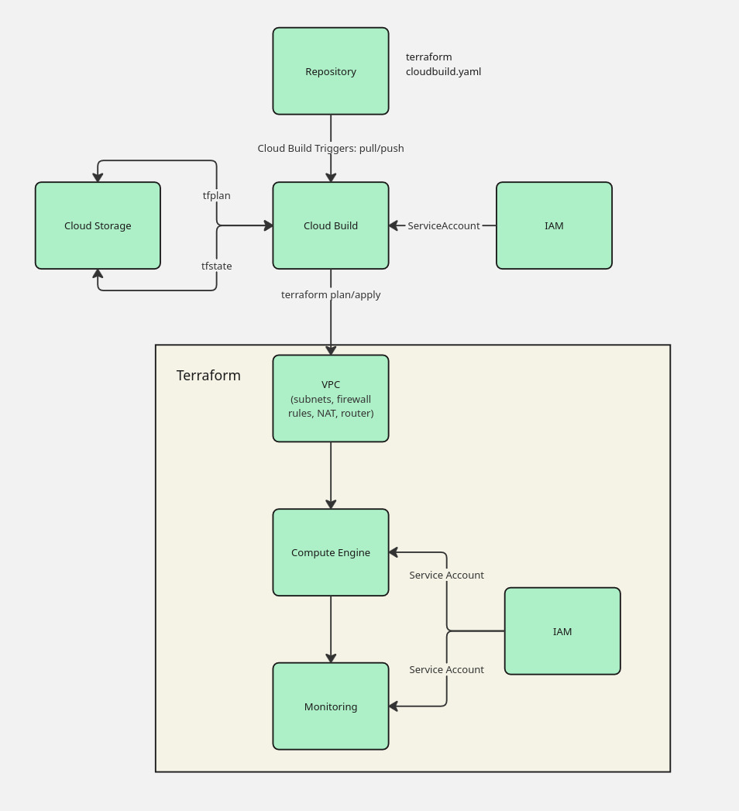

# ☁️ LevelUP Terraform – Automated GCP Deployment

A complete landing zone for the LevelUP initiative on Google Cloud Platform. The repository packages reusable Terraform modules, a remote Cloud Storage backend, and Cloud Build integration so the entire stack (network, VM, IAM, monitoring) is reproducible and deployed from code.

We deliberately follow IaC best practices: every resource is codified in reusable Terraform modules committed to Git; state and lock files reside in a versioned GCS backend to prevent drift. Cloud Build pipelines enforce `fmt`, `validate`, `plan`, and `apply` steps on every PR and push; branch protection rules mandate peer review before merging to `main`. Automation runs under dedicated least-privilege service accounts. Naming/tagging conventions, logging/monitoring defaults, plus exported outputs are consistent across modules so the resulting environments stay auditable and easy to operate.

## TL;DR

-   **Scope**: one dev landing zone in project `terraformgroup4` (region `us-central1`) covering VPC, VM, IAM, monitoring/alerting, and automation glue.
-   **State & locking**: remote backend lives in `gs://levelup-group4-terraform-state/prefix=dev`, so local runs and Cloud Build share the exact history/locks.
-   **Modules**: custom VPC with NAT + flow logs, Debian 12 e2-small VM with startup script/Ops Agent, two dedicated service accounts, and notification policies with email channel.
-   **Pipelines**: Cloud Build PR trigger runs `fmt`/`validate`/`plan` and stores the signed `tfplan`; the main trigger picks up merges and applies the stored plan automatically.
-   **Operations**: local operators can still run `terraform apply -var-file=tfvars/dev.tfvars`, but rollout/rollback is expected to go through the pipelines for auditability.
-   **Evidence**: Terraform outputs (IP, SA emails, instance ID) plus Cloud Build + Cloud Logging traces document every deployment; backend and triggers were bootstrapped manually once.

## Business Context

This project aims to deploy Google Cloud Platform (GCP) infrastructure in a fully automated way using Terraform and Cloud Build. The goal is to establish a repeatable, version-controlled Infrastructure as Code (IaC) workflow that ensures consistency and efficiency across environments.

The project scope includes:

-   Configuring Terraform files for VPC, virtual machines, firewall rules, and IAM policies.
-   Using Cloud Storage as the backend for managing Terraform state.
-   Integrating Terraform with Cloud Build to automatically trigger `terraform plan` and `terraform apply` through CI/CD pipelines.
-   Enabling monitoring, logging, and alerting in Cloud Monitoring for infrastructure observability.

Technologies used: Terraform, Cloud Build, Compute Engine, Cloud Storage, IAM, and Cloud Monitoring.

Team responsibilities:

1. Develop Terraform modules for networking, VM instances, and IAM configuration.
2. Integrate the Git repository with Cloud Build for automated deployment.
3. Execute automated deployments and verify rollback procedures.
4. Analyze automation time and cost efficiency.

The final outcome is a fully automated GCP infrastructure deployment, reproducible from version-controlled source code.

## Architecture

Terraform provisions a minimal yet production-ready stack: a custom VPC with Cloud NAT and flow logs, a hardened Debian VM joined via dedicated service accounts, and monitoring policies that feed an email channel. All of it is orchestrated through Cloud Build pipelines and backed by a shared GCS state bucket so rollouts and rollbacks stay consistent.

```
GitHub (main + PR branches)
   │
   ├─ Cloud Build triggers
   │     ├─ PR: fmt → validate → plan → upload tfplan
   │     └─ Main: fmt → validate → download tfplan → apply → cleanup
   │
Terraform backend (gs://levelup-group4-terraform-state/dev)
   │
   ├─ module.network → VPC + subnet + firewalls + Cloud NAT + flow logs
   ├─ module.iam     → workload & monitoring service accounts + IAM bindings
   ├─ module.vm      → Compute Engine VM with startup script, Ops Agent, labels
   └─ module.monitoring → email channel + CPU/disk alert policies referencing VM
```

<p align="center">
  
</p>

> **Note:** This diagram shows the high-level architecture, not the actual creation order of Terraform modules. Terraform automatically determines the sequence based on resource dependencies. The diagram focuses on illustrating logical relationships rather than the dependency graph used during plan/apply.

### Module Details

| Module                  | Resources                                                         | Highlights                                                                                                                                  |
| ----------------------- | ----------------------------------------------------------------- | ------------------------------------------------------------------------------------------------------------------------------------------- |
| `modules/network`       | `google_compute_network`, subnetwork, two firewalls, router + NAT | VPC `10.0.0.0/28` with Private Google Access, flow/firewall logging, SSH/ICMP admin rule, Cloud Router + NAT (errors-only logging)          |
| `modules/iam`           | 2× `google_service_account`, `google_project_iam_member` bindings | Workload SA with `roles/logging.logWriter` + `roles/monitoring.metricWriter`, monitoring SA with viewer roles; both exported as outputs     |
| `modules/vm`            | `google_compute_instance`, startup template                       | Debian 12 `e2-small`, OS Login/OS Config metadata, attaches workload SA, startup template installs Nginx + Ops Agent and stamps labels/tags |
| `modules/monitoring`    | notification channel + two alert policies                         | Email channel (`ursz.kam@gmail.com`), CPU>80 % & disk>90 % alerts keyed to VM `instance_id`, markdown docs + severity labels                |

## Delivery Highlights

### 🌐 Network

-   Custom VPC `levelup-dev-vpc` (`10.0.0.0/28`) is created with `auto_create_subnetworks = false`, so every subnet or route is expressed in Terraform rather than inherited from Google’s default network; /28 gives 13 usable addresses, enough for a single VM plus future helpers without wasting IP space.
-   The single subnet (`levelup-dev-subnet`) lives in `us-central1`, takes advantage of its four zones (for resilience) and lower-cost e2 pricing, turns on Private Google Access, and pushes flow logs with 30% sampling + full metadata—enough for troubleshooting without flooding logs.
-   Firewall rules: internal TCP/UDP within the CIDR, SSH/ICMP from anywhere for administrators, and HTTP on port 80 (tagged `vm`) so the demo Nginx page is reachable. All rules keep `log_config` enabled so access attempts show up in Cloud Logging.
-   A Cloud Router + Cloud NAT pair provides outbound internet for the subnet. NAT logging is set to `ERRORS_ONLY`, which proves translations work while keeping log volume (and cost) under control.

### 🖥️ Compute

-   `levelup-dev-vm` is a single `e2-small` Compute Engine VM running the Debian 12 image with a 20 GB boot disk. That size is the smallest that comfortably runs Ops Agent plus the demo workload.
-   Terraform queries `google_compute_zones` and picks the first zone in `us-central1`, so builds continue even if a specific zone is unavailable.
-   OS Login/OS Config metadata is enabled, the VM attaches the dedicated service account with full Cloud Platform scope, and startup automation writes env metadata, installs Nginx, and runs Google Ops Agent.
-   The instance carries consistent labels (`env`, `project`, `role=app-vm`) and tags (`dev`, `vm`) so firewall rules, IAM conditions, and monitoring filters line up with the rest of the stack.

### 🔐 IAM

-   Workload Service Account (`levelup-dev-vm-sa`) owns logging/metrics write permissions and API access scope (`Logs Writer`, `Monitoring Metric Writer`).
-   Monitoring Service Account (`levelup-dev-monit-sa`) keeps read-only monitoring/logging roles for downstream automation (`Logs Viewer`, `Monitoring Viewer`)
-   Outputs expose the SA emails for other modules or external tooling.

### 📟 Monitoring & Alerts

-   A single email notification channel (`Email alerts dev`) sends incidents to `ursz.kam@gmail.com`, so no extra wiring is needed after deploy.
-   Two alert policies ship with the stack: CPU utilization above 80 % for 5 minutes and disk usage above 90 % (Ops Agent metric `disk/percent_used` with `state=used`) for the VM instance ID.
-   Both policies include short markdown docs that name the VM and condition, so responders know what failed straight from the email.
-   Labels `env=dev` plus `severity=warning`/`high` accompany each alert, which keeps dashboards and filters consistent with the rest of the configuration.
    Ops Agent streams metrics/logs to Cloud Monitoring/Logging, alerts stick to the VM `instance_id`, and the existing email channel can be expanded with extra `google_monitoring_notification_channel` resources (Slack/webhook/SMS) if we need more destinations.

### CI/CD

-   `cloudbuild.yaml` proves the repo-to-Cloud Build connection (echoing repo and commit). Adding Terraform steps converts it into a full apply pipeline.
-   `cloudbuild-pr.yaml` is reserved for PR validation (fmt/validate/plan) so merges stay predictable.
-   Shared GCS backend ensures both local and CI runs use the same state.
-   (Optional) Place a Cloud Build run screenshot near this section to highlight the custom service-account trigger and Terraform steps in the build log.

## Out-of-band Components (Prerequisites)

Some foundational pieces were created once outside of Terraform and then referenced by the code:

-   **APIs enabled on the target project** – Cloud Resource Manager API (required for project-level IAM bindings), Compute Engine, Cloud Logging/Monitoring, Cloud Storage and Cloud Build.
-   **Cloud Storage backend** – bucket `levelup-group4-terraform-state` (prefix `dev`) was created manually in the `terraformgroup4` project with uniform bucket-level access and versioning enabled. The Terraform operator account and the Cloud Build service account were granted `roles/storage.objectAdmin` and `roles/storage.legacyBucketReader` on the bucket so remote state files and locks are centrally stored and protected from accidental deletion.
-   **Cloud Build custom service account** – a dedicated service account (provisioned via the GCP console) executes all Cloud Build triggers. It owns granular roles (`Cloud Build Editor`, `Cloud Build Service Account`, `Cloud Build Service Agent`, `Compute Instance Admin (v1)`, `Compute Network Admin`, `Compute Security Admin`, `Logging Admin`, `Monitoring Admin`, `Security Admin`, `Service Account Admin`, `Service Account User`, `Storage Object Admin`) which allow it to run Terraform, manipulate the state bucket, and configure Compute/Monitoring resources without elevating to project owner. Each trigger references this service account explicitly, ensuring that plan/apply jobs use the same identity and audit trail both when running locally and through CI.
-   **Repository protections** – the GitHub repository has branch protection on `main` (required reviews + passing Cloud Build checks) so every change, including rollbacks, flows through a PR and the automated pipelines before landing.

## CI/CD Details

### Cloud Build (PR)

The cloudbuild-pr.yaml file defines the Pull Request validation pipeline.
This pipeline performs non-destructive checks: formatting, validation, and planning.
Thanks to that the infrastructure changes are correct and can be reviewed before being merged into the main branch.

-   It enables a lightweight pipeline. The trigger also runs as the custom Build service account so it can reuse the shared state bucket without additional credentials.
    -   `terraform-fmt` with a `-recursive` flag format all the terraform configuration to keep the code clean and uniform.
    -   `terraform-init` initializes providers and connects to the remote Google Cloud Storage state backend so that PR validation uses the exact same state as the main deployment pipeline.
    -   `terraform-validate` verifies that the Terraform configuration is correct before generating a plan.
    -   `terraform-plan` generates an execution plan that shows exactly what Terraform would change. The plan file (`default.tfplan`) is then uploaded to Google Cloud Storage for later use by the main pipeline.
    -   `upload-tfplan` uploads the generated plan file to the shared Google Cloud Storage bucket used by the main pipeline.
-   Plan output can be surfaced in PR comments or logs, ensuring every merge is preceded by state/policy verification.


CI gate on PRs: Cloud Build always runs fmt/validate/plan (and uploads the plan), so every change is reviewed against the same plan path. Merges unlock only when that check turns green.

### Cloud Build (main)

The cloudbuild.yaml file is used for continuous integration between the repository and Cloud Build. It automatically triggers Cloud Build pipelines whenever changes are pushed to the repository. The image hashicorp/terraform:1.13.0 is used.

1. GitHub repo is cloned via a Cloud Build trigger that explicitly runs as the custom Build service account.
2. The initial verification step (`gcloud` echo) confirms that this account has access to the target project and can write logs.
3. The cloudbuild.yaml file is the main deployment pipeline for running each step:
    - `terraform-fmt` with a `-recursive` flag format all the terraform configuration to keep the code clean and uniform.
      The result is stored in the `terraform-fmt.log`.
    - `terraform-init` initializes Terraform, downloads providers and connects to the remote Google Cloud Storage backend. The logs for this step are stored in the `terraform-init.log`.
    - `terraform-validate` checks that the code and the structure are correct. The result is logged into the terraform- validate.log
    - `download-tfplan` downloads a Terraform plan from the Google Cloud Storage bucket. The plan is generated by the `cloudbuild-pr.yaml` pipeline.
    - `terraform-apply` applies the Terraform plan to the cloud environment. The auto-approve flag keeps the CI/CD deplyments fully automated.
    - `cleanup-tfplan` removes the used plan file from the Google Cloud Storage bucket.
4. Logs land in Cloud Logging for audit and troubleshooting, and Terraform state operations reuse the manually provisioned GCS backend so local runs and CI share locking.

### Rollback & Test Scenario

Rollback always happens through the automated Cloud Build triggers, so pushing a revert or opening a rollback PR is all it takes—pipelines pick up the change, regenerate the plan, and apply it without manual intervention.

-   **Flow**:
    1. Revert or cherry-pick the desired commit into a dedicated rollback branch and open a PR (direct pushes to `main` should be blocked).
    2. The PR trigger (`cloudbuild-pr.yaml`) runs automatically, producing a deterministic `tfplan` stored in `gs://levelup-group4-terraform-state/plans/default.tfplan`.
    3. Once the PR is approved and merged into `main`, the main trigger (`cloudbuild.yaml`) fires, downloads that plan, and executes `terraform apply`, which reconciles only the drift.
    4. Monitor the Cloud Build logs, Terraform outputs, and quick alert/VM checks to confirm the environment matches the expected revision.
-   **Determinism**: shared GCS state makes every rollback predictable—no bespoke scripts needed.
-   **Test scenarios**: 
    - Scale VM up (machine type + disk size) and rollback to validate recreations and external IP restoration.
    - Change subnet CIDR (VPC + NAT) and rollback to ensure dependent firewall/router/NAT/VM flow is reversible.
    - Break CI intentionally (e.g., invalid config) to confirm PR runs fail fast while main stays clean.

## Cost & Time

-   Monthly costs (≈ **$17.55** total):
    -   Compute Engine `e2-small` (cores + RAM) ≈ $12.23.
    -   Cloud NAT (uptime + 10 GiB data + 1 public IP) ≈ $5.12.
    -   Logging retention 10 GB ≈ $0.10; state bucket 10 GB ≈ $0.10; other logging/monitoring/storage usage stays in the free tier.
    -   Cloud Build runtime usually sits in the free tier.

[Cost estimation using Pricing Calculator](https://cloud.google.com/products/calculator?hl=en&dl=CjhDaVE1WkRnek56STFZUzA1TXprMkxUUTJPV0l0WWpoaE1DMDROelpqTUdFelpUZ3dZVEVRQVE9PRAOGiRCMjE2NTE3My02MTIzLTQxNDEtODZERi0wRjAzMjRGMzRGOEU)

-   Time to deploy:
    -   PR pipeline (`cloudbuild-pr.yaml`): `fmt`/`validate` plus plan typically finish in under 30 seconds, regardless of how many resources change. The plan upload takes only a few seconds and is negligible.
    -   Main pipeline (`cloudbuild.yaml`): apply usually lands between 1–3 minutes depending on how much is changing. Downloading the plan adds only a few seconds.
-   Manual runs: `terraform apply` and quick verification locally take ~1–3 minutes. Rollback/destroy is typically ~1–2 minutes.


## Planned Improvements

-   Add more environments (e.g., `stage`, `prod`) and migrate through them gradually as we validate the stack, keeping per-env state and isolated pipelines.
-   Tighten GitHub branch protections so merges require passing Cloud Build checks and prevent concurrent merges that could race on stored plans.
-   Improve plan versioning/retention in GCS to avoid overwriting reviewed plans and make rollback/apply flows more deterministic.
